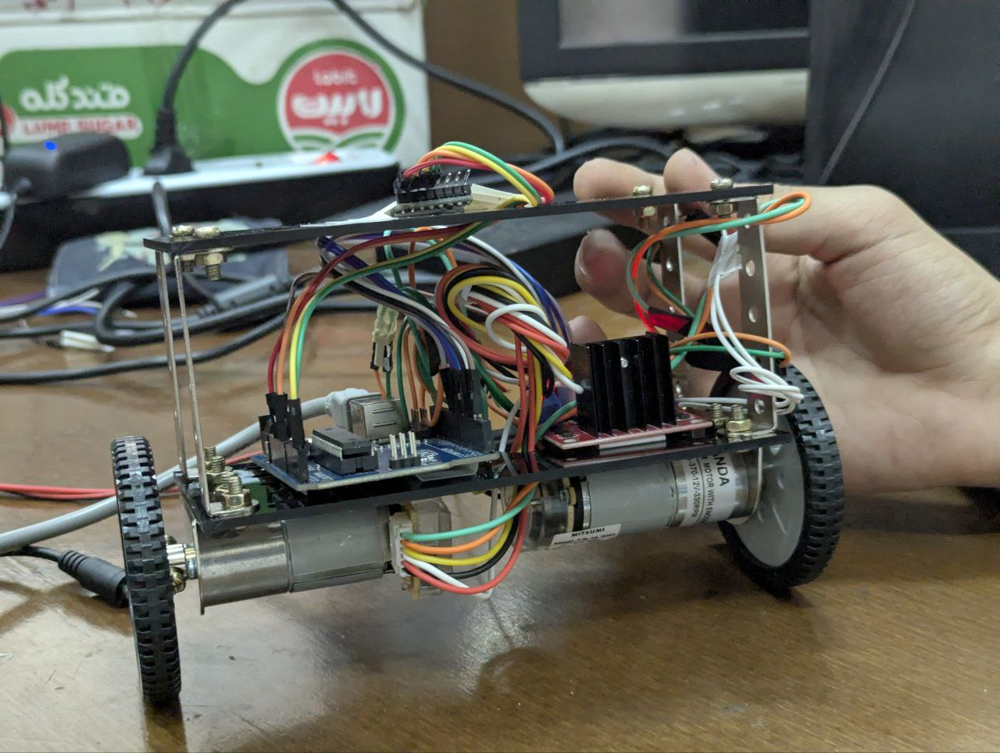
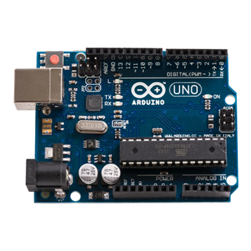
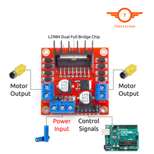
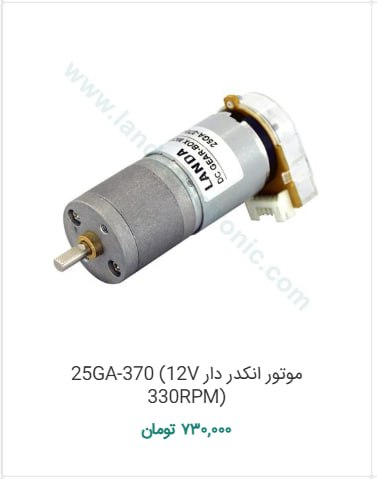
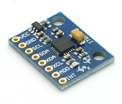

# Two-Wheeled Balancing Robot

This project is about building a **two-wheeled balancing robot** using **Arduino UNO**, **L298N motor driver**, and **25GA 33RPM DC motors**. The robot is designed to maintain balance and navigate through its environment using a modular structure and control algorithms.

<!-- Display Image -->

<!-- Display Video -->
## Robot Video

## Structure of the Robot
The robot's frame is built using three lightweight plates, which house the core components:

## **Arduino UNO**
- The **Arduino UNO** is the microcontroller that executes the robot's code. It processes sensor data, controls the motors, and ensures the robot maintains balance.
  

## **L298N Motor Driver**
- The **L298N** motor driver controls the direction and speed of the **DC motors**, translating the signals from the **Arduino UNO** into movement.

## **2x 25GA 330RPM DC Motors**
- The **DC motors** drive the wheels of the robot, allowing it to move, balance, and adjust its position as needed.

## MPU6050 Sensor
- The MPU6050 is a 6-axis motion tracking sensor that combines a 3-axis accelerometer and a 3-axis gyroscope. It measures both acceleration and angular velocity in three dimensions, providing critical data for balancing the robot. By continuously monitoring the robot's tilt and rotational speed, it helps maintain balance and stability during movement.
  

## **Power Supply (Adapter)**
- The robot is powered using an **adapter** instead of batteries, ensuring stable power for both the electronics and motors.

